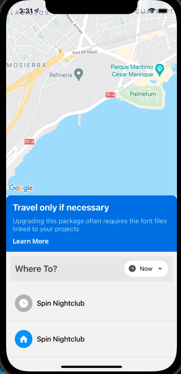
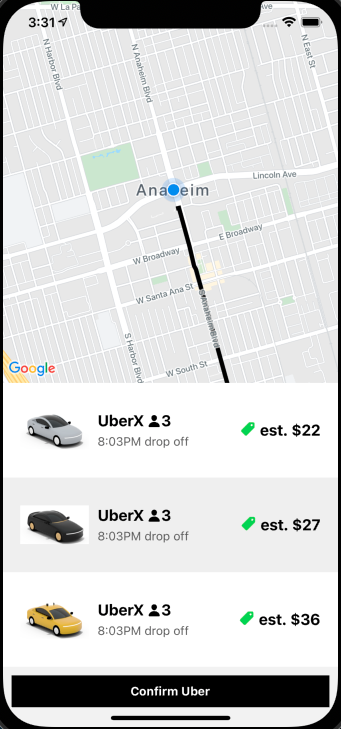
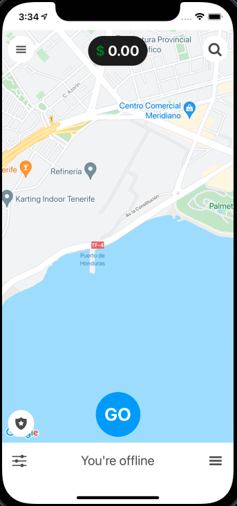
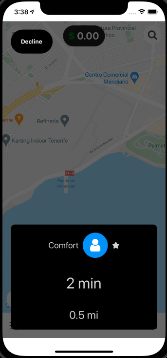

# UberClone
This project is using React Native with AWS Amplify. Also built two apps within this project; User and Driver app. Both User and Driver apps connected to pass the data for orders. User app can request the order and sent it to the Driver app for the driver to accept or decline. The order provides the miles and duration for pickup and dropoff.

## Tools used for this project:
- [React-Native](https://reactnative.dev/docs/getting-started)
- [Aws Amplify](https://docs.amplify.aws/start/q/integration/react-native/)
- [React Navigation in V5](https://reactnavigation.org/docs/getting-started)
- [Google Cloud for APIs (Geolocation and Maps)](https://cloud.google.com/)
- [React Native Maps](https://github.com/react-native-maps/react-native-maps)

## Demo

<table border="0">
 <tr>
    <td><b style="font-size:20px">
User App
</b></td>
    <td><b style="font-size:20px">
Driver App
</b></td>
 </tr>
 <tr>
    <td>
        
        
    </td>
    <td>
        
        
        </td>
 </tr>
</table>
